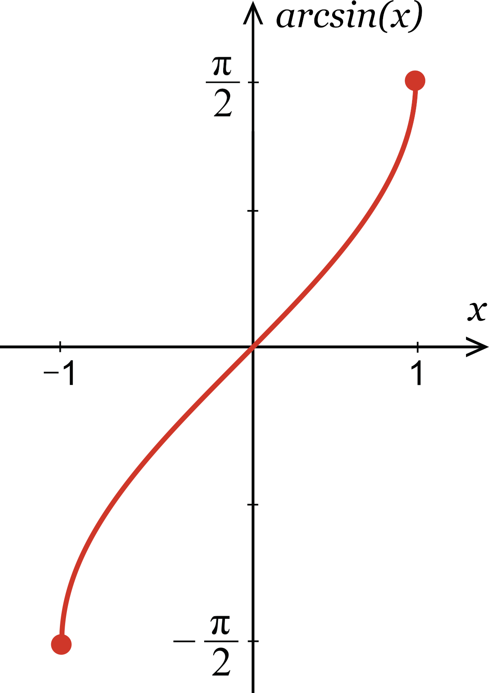
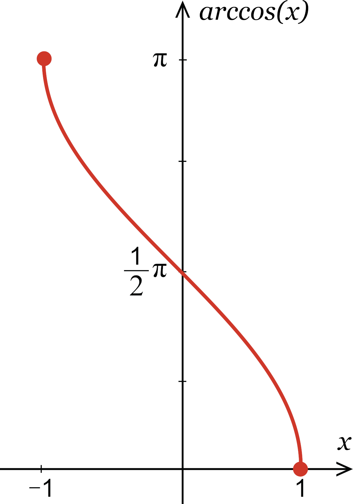
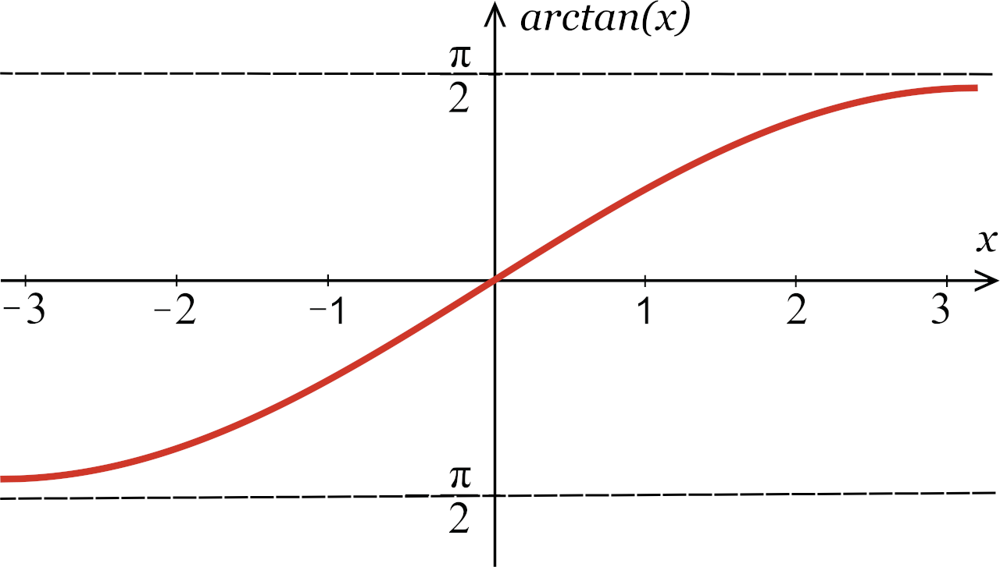

# 高数学习预备知识

## 反三角函数

### 反正弦函数的定义

正弦函数$y=\sin x$在主值区间$\left[-\frac{\pi}{2}, \frac{\pi}{2}\right]$上的反函数。记作$y=\arcsin x$或$y=\sin ^{-1}x$.

**$y=\arcsin x$是区间$\left[-\frac{\pi}{2}, \frac{\pi}{2}\right]$上正弦值等于$x$的一个角.**

定义域：$\left[1,-1\right]$  
值域：$\left[-\frac{\pi}{2}, \frac{\pi}{2}\right]$

**重要等式**

（1）当$x \in [-1,1]$时，$\arcsin (-x)=-\arcsin x$;  
（2）当$x \in \left[-\frac{\pi}{2}, \frac{\pi}{2}\right]$时，$\arcsin (\sin x)=x$;  
（3）当$x \in [-1,1]$时,$\sin (\arcsin x)=x$.

### 反余弦函数的定义

余弦函数$y=\cos x$在主值区间上$[0,\pi]$上的反函数，叫做反余弦函数。记为$y=\arccos x$或$y=\cos ^{-1}x$.

**$y=\cos ^{-1}x$是区间$[0,\pi]$上余弦值等于$x$的一个角.**

定义域：$\left[1,-1\right]$  
值域：$\left[0, \pi\right]$

**重要等式**

（1）当$x \in [-1,1]$时，$\arccos (-x)=\pi-\arccos x$;  
（2）当$x \in \left[0, \pi\right]$时，$\arccos (\cos x)=x$;  
（3）当$x \in [-1,1]$时,$\cos (\arccos x)=x$;  
（4）当$x \in [-1,1]$时,$\sin (\arccos x)=\sqrt {1-x^2}$,  
$\cos (\arcsin x)=\sqrt {1-x^2}$,$\arcsin x+\arccos x=\frac{\pi}{2}$.

### 反正切函数的定义

正切函数$y=\tan x$在开区间$(-\frac{\pi}{2}，\frac{\pi}{2})$内的反函数，叫做反正切函数。记为$y=\arctan x$或$y=tan ^{-1}x$

**$y=\tan ^{-1}x$是区间$(-\frac{\pi}{2}，\frac{\pi}{2})$内正切值等于$x$的一个角.**

定义域：$(-\infty,\infty)$  
值域：$(-\frac{\pi}{2}，\frac{\pi}{2})$

**重要等式**

（1）当$x \in(-\infty,\infty)$时，$\tan ^{-1}(-x)=-\tan ^{-1}x$;  
（2）当$x \in(-\frac{\pi}{2},\frac{\pi}{2})$时，$tan ^{-1}(\tan x)=x$;  
（3）当$x \in(-\infty,\infty)$时，$\tan ^{-1}(\tan x)=x$.
